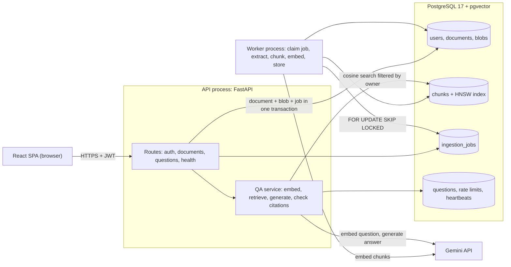
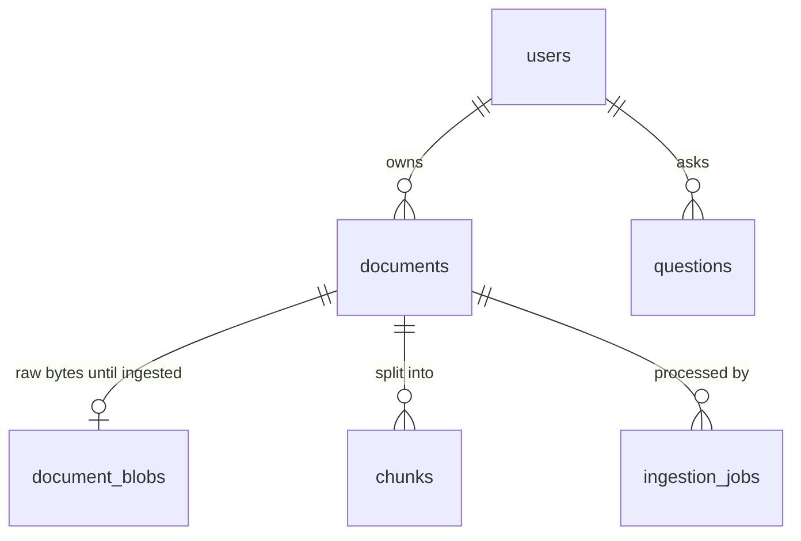

# DocuMind: Design

Written before implementation (30 Sep 2026). Anything that changes while building is recorded in
[Changes during the build](#16-changes-during-the-build) at the end, with the reason.

## 1. Goal

A team uploads internal documents (policies, manuals, onboarding guides) and asks questions in plain
language. Every answer must be grounded in those documents and cite the exact passage it came from. If the
documents do not contain the answer, DocuMind says so instead of guessing.

The first version has to run on free infrastructure, pass CI without API keys, and stay small enough that
one person can explain every part of it.

## 2. Requirements

### Functional

| ID | Requirement |
|----|-------------|
| F1 | Sign up and log in with email and password. Passwords are hashed. Token (JWT) auth on every document and question endpoint. |
| F2 | A user can only ever see or touch their own documents, chunks and question history, including when guessing IDs. |
| F3 | Upload PDF, `.txt` and `.md` files up to 10 MB. The upload returns immediately; extraction, chunking and embedding run in a separate worker. |
| F4 | Each document shows `queued`, `processing`, `ready` or `failed` (with a reason). Documents can be listed and deleted; deleting removes its chunks and embeddings. |
| F5 | Ask a question across all ready documents or a selected subset. The response has the answer, citations (document, page, exact passage) and usage (tokens, latency, estimated cost). |
| F6 | Question history is stored per user and can be listed and reopened. |
| F7 | Minimal web UI for the whole flow, plus interactive OpenAPI docs on the live site. |

### Non-functional

| ID | Requirement |
|----|-------------|
| N1 | Answers use only retrieved content. "Not found" is preferred over a confident guess. |
| N2 | Document text is data, never instructions (prompt-injection resistance). |
| N3 | Per-user rate limit on questions so the public link cannot drain the LLM quota. |
| N4 | LLM or embedding failures and timeouts give a clear error, never a crash; transient failures are retried. |
| N5 | `/health` reports database, vector store, queue and worker status. |
| N6 | JSON logs with a request ID that follows a request from the API into the worker. |
| N7 | `docker compose up` runs the full system locally; CI lints, tests and builds images on every PR. |
| N8 | No secrets in the repository or images; all configuration comes from environment variables. |

## 3. Assumptions

My own calls where the brief leaves room. Each one is a setting or a small change.

1. **Workspace = user.** Each user sees only their own documents, so there is no team sharing in v1.
2. **Email is the username.** Sign-up takes an email and a password of 8 to 128 characters.
3. **Limits sized for a public free-tier demo:** 10 MB per file, 20 documents per user, 10 questions per
   minute and 100 per day per user, and a global daily question cap set below the Gemini free quota so one
   visitor cannot use it all up. All of them are environment variables.
4. **No OCR.** A scanned PDF without a text layer ends up `failed` with "no extractable text".
5. **English first.** The embedding model is multilingual, but prompts, evaluation and refusal wording are
   English.
6. **Questions are independent.** No conversation memory in v1.
7. **History is an audit trail.** Deleting a document removes its chunks and embeddings, so it is never cited
   again, but past answers in the history keep a snapshot of what they cited.
8. **Raw files are temporary.** The uploaded bytes are kept only until ingestion finishes (success or permanent
   failure), then deleted. The free database is 1 GB and nothing needs the original file afterwards.
9. **Cost is an estimate** at Google's paid-tier list prices, even though the demo runs on the free tier.
10. **Free-tier data terms.** Google may use free-tier prompts to improve its products, which is fine for the
    public documents in this demo. A real deployment with internal documents would use a paid key.

## 4. Architecture



| Component | Responsibility |
|-----------|----------------|
| **Web UI** | React + TypeScript SPA built with Vite, served as static files by the API (one origin, no CORS). |
| **API** | FastAPI: auth, validation, uploads, question answering, history, health, OpenAPI docs at `/docs`. |
| **Worker** | A plain Python process that polls the job table, runs ingestion and writes a heartbeat every 10 s. |
| **PostgreSQL + pgvector** | Users and documents, the vector store (HNSW index), the job queue, rate-limit counters, worker heartbeats. |
| **Gemini API** | `gemini-embedding-001` (768 dimensions) for embeddings and `gemini-3.5-flash-lite` for answers. Both model IDs are settings, and both sit behind small interfaces with fakes for tests. |

### Containers and deployment

Each service has its own Dockerfile, built on `python:3.12-slim` with multi-stage builds and a non-root user:

- `backend/Dockerfile` (API): a Node stage builds the SPA, a uv stage installs locked dependencies, and the
  runtime stage copies both.
- `backend/worker.Dockerfile` (worker): the same dependency stage without the frontend.

| | Local (`docker compose up`) | Live (Render free tier) |
|---|---|---|
| Database, vector store, queue | `pgvector/pgvector:pg17` with a named volume and a health check | Render Postgres 17 (free), `CREATE EXTENSION vector` |
| Migrations and demo seed | one-shot `migrate` service; `api` and `worker` wait for it to complete | run by the supervisor before the processes start |
| API | `api` container | Render web service built from `backend/Dockerfile` |
| Worker | `worker` container | second process in the same web service (see below) |

Render's free plan has no background-worker service type. On Render the API image starts `app.supervisor`,
which runs migrations, starts uvicorn and the worker as child processes, forwards `SIGTERM` to both, and exits
if either one dies so that Render restarts the container. Locally they are separate containers. On a paid
plan the worker becomes its own Render service with no code change.

Render's health check points at `/health/live`, which answers without touching the database, so a slow cold
start or a restarting worker never puts the container into a restart loop. `/health` is the full dependency
report for people and monitoring.

## 5. Key flows

### Upload and ingestion

1. `POST /api/documents` reads the upload in chunks and stops at 10 MB (`413`). It checks the extension and
   the content: `%PDF-` magic bytes for PDFs, valid UTF-8 for `.txt`/`.md` (`415` otherwise). A file with the
   same SHA-256 as one the user already has is rejected with `409`.
2. In one transaction the API inserts the `documents` row (`queued`), the bytes into `document_blobs` and an
   `ingestion_jobs` row carrying the request ID, then returns `202 Accepted`. Because the job is written in
   the same transaction, a document can never exist without its job.
3. The worker claims the oldest runnable job with `FOR UPDATE SKIP LOCKED` (safe with several workers) and
   sets the document to `processing`.
4. Extraction: `pypdf` page by page for PDFs, UTF-8 text for `.txt`/`.md`. NUL bytes (Postgres rejects them)
   and repeated whitespace are removed. Encrypted, corrupt or text-less PDFs fail with a readable reason.
5. Chunking (section 8.1), then embedding in batches of up to 50 chunks.
6. Chunks are inserted, the document becomes `ready`, the job `done`, and the blob is deleted, all in one
   transaction. If the user deleted the document in the meantime, the cascade has already removed the job and
   the worker drops the result.
7. Transient failures (Gemini 429/5xx, timeouts, lost database connection) put the job back with exponential
   backoff (15 s, 60 s); after 3 attempts the document is `failed` with the last error. Permanent failures
   fail immediately.
8. Jobs left `running` for more than 10 minutes (a worker died mid-job) are put back in the queue.

### Answering a question

1. `POST /api/questions` authenticates the user and applies the rate limits (per minute, per day, global daily
   cap). Over the limit returns `429` with `Retry-After`.
2. If `document_ids` is given, every ID must belong to the user (`404` otherwise) and be `ready` (`409`). A
   user with no ready documents gets the "not found" answer without any model call.
3. **Cache:** if the same user asked the same normalised question over the same set of ready documents in the
   last 24 hours, the stored answer is returned (marked `cached`, zero tokens).
4. The question is embedded with the `RETRIEVAL_QUERY` task type.
5. The top 6 chunks by cosine similarity are fetched, always filtered by `owner_id` (and by document ID when
   a subset was selected).
6. **Gate 1 (retrieval):** if even the best chunk is below a similarity floor, the answer is "I couldn't find
   this in your documents" and the LLM is not called.
7. The prompt is built with the chunks as delimited, numbered sources (section 8.5) and sent to Gemini with
   a JSON schema for the reply: `{found, answer, citations: [{source_id, quote}]}`.
8. **Gate 2 (grounding):** only citations whose `source_id` was actually sent are kept, and each quote is
   checked against its source (section 8.4). If the model says `found=false`, or claims an answer without a
   single valid citation, the response is the "not found" answer.
9. The answer, citations (with a snapshot of document name, pages and passage) and usage are stored in
   `questions` and returned.

## 6. API contract

**Conventions**

- Base path `/api`. Auth header `Authorization: Bearer <jwt>`. Swagger UI at `/docs` supports the OAuth2
  password flow, so a reviewer can click "Authorize" and try every endpoint.
- IDs are UUIDs. A resource that belongs to someone else returns `404`, exactly like one that does not exist.
- Every JSON response uses one envelope, and every response carries an `X-Request-ID` header:

```json
{ "success": true, "data": { "...": "..." }, "error": null, "meta": null }
{ "success": false, "data": null, "error": { "code": "rate_limited", "message": "Too many questions. Try again in 42 seconds.", "request_id": "5f0c9d..." }, "meta": null }
```

- List endpoints put `{ "total", "limit", "offset" }` in `meta`.

**Endpoints**

| Method and path | Auth | Request | `data` in the response |
|---|---|---|---|
| `POST /api/auth/signup` | no | `{email, password}` | `201` `{access_token, token_type, expires_in, user}` |
| `POST /api/auth/login` | no | `{email, password}` | `{access_token, token_type, expires_in, user}` |
| `POST /api/auth/token` | no | form `username`, `password` | `{access_token, token_type}` (plain OAuth2 shape for Swagger) |
| `GET /api/auth/me` | yes | | `User` |
| `POST /api/documents` | yes | multipart `file` | `202` `Document` |
| `GET /api/documents` | yes | `?limit&offset` | `Document[]`, newest first |
| `GET /api/documents/{id}` | yes | | `Document` |
| `DELETE /api/documents/{id}` | yes | | `204`, no body |
| `POST /api/questions` | yes | `{question, document_ids?}` | `Answer` |
| `GET /api/questions` | yes | `?limit&offset` | `Answer[]`, newest first |
| `GET /api/questions/{id}` | yes | | `Answer` |
| `GET /health` | no | | `{status, checks: {database, vector_store, queue, worker}}`; `503` if any check fails |
| `GET /health/live` | no | | `{status: "ok"}` (process is up; used by the platform) |

**Shapes**

```text
User      { id, email, created_at }
Document  { id, filename, content_type, size_bytes, status, error, page_count, chunk_count,
            created_at, updated_at }
Answer    { id, question, answer, found, cached, document_ids, citations: Citation[], usage: Usage,
            created_at }
Citation  { source_id, document_id, document_name, page_start, page_end, section, passage,
            quote, quote_verified, score }
Usage     { model, prompt_tokens, output_tokens, total_tokens, embedding_tokens,
            retrieval_ms, generation_ms, latency_ms, estimated_cost_usd }
```

Error codes: `validation_error` (422), `unauthorized` (401), `not_found` (404), `conflict` (409: duplicate
upload, document not ready), `payload_too_large` (413), `unsupported_media_type` (415), `rate_limited` (429),
`llm_unavailable` and `embedding_unavailable` (503), `internal_error` (500). Messages are written for people
and never include SQL, constraint names, hashes or provider internals.

## 7. Data model



| Table | Main columns | Notes |
|---|---|---|
| `users` | `id`, `email` (unique, lower-cased), `password_hash`, `created_at` | Argon2id hashes |
| `documents` | `id`, `owner_id`, `filename`, `content_type`, `size_bytes`, `sha256`, `status`, `error`, `page_count`, `chunk_count`, timestamps | `UNIQUE (owner_id, sha256)`; `CHECK` on status; `UNIQUE (id, owner_id)` for the composite key below |
| `document_blobs` | `document_id`, `data bytea` | Separate so listing documents never reads file bytes; deleted after ingestion |
| `chunks` | `id`, `document_id`, `owner_id`, `chunk_index`, `text`, `page_start`, `page_end`, `section`, `embedding vector(768)` | HNSW cosine index; `FOREIGN KEY (document_id, owner_id) REFERENCES documents (id, owner_id)` |
| `ingestion_jobs` | `id`, `document_id`, `status`, `attempts`, `run_after`, `locked_at`, `locked_by`, `last_error`, `request_id`, timestamps | Partial index on queued jobs by `run_after` |
| `questions` | `id`, `user_id`, `question`, `answer`, `found`, `document_ids uuid[]`, `citations jsonb`, `usage jsonb`, `cache_key`, `created_at` | Indexes on `(user_id, created_at desc)` and `(user_id, cache_key)` |
| `rate_limit_counters` | `key`, `window_start`, `count` | Fixed windows, atomic upsert; old windows cleaned up hourly by the worker |
| `worker_heartbeats` | `worker_id`, `hostname`, `started_at`, `last_seen_at` | Read by `/health` |

`chunks.owner_id` duplicates the document's owner so the vector search can filter on it directly. The
composite foreign key makes the database itself reject a chunk whose owner differs from its document's owner,
so a bug in ingestion cannot leak chunks across users. Every foreign key to `documents` is
`ON DELETE CASCADE`: one `DELETE` removes the blob, jobs, chunks and embeddings.

Schema changes go through Alembic migrations. Migrations take a Postgres advisory lock so two starting
containers cannot run them at the same time.

## 8. Retrieval and generation

### 8.1 Chunking

- Split on structure first (Markdown headings, then blank lines, then sentences), then pack the pieces into
  chunks of about 1,400 characters (roughly 350 tokens) with about 200 characters of overlap.
- Each chunk records where it came from: the page range for PDFs, the heading path for Markdown (for example
  `Travel policy > Per diem`). The heading path is prepended to the text that gets embedded, which helps short
  chunks that do not repeat their topic.
- Why this size: a citation has to point at a specific passage, so chunks should be small, but a chunk also
  has to hold a whole rule with its conditions. About 350 tokens is the middle ground, and the evaluation
  measures it.

### 8.2 Embeddings

`gemini-embedding-001` with `output_dimensionality=768`: `RETRIEVAL_DOCUMENT` with the document name as the
title for chunks, `RETRIEVAL_QUERY` for questions. Vectors are L2-normalised before storage because only the
full 3,072-dimension output comes normalised.

- **Why an API model rather than a local one:** the free Render instance has 512 MB of RAM and 0.1 CPU,
  shared by the API and the worker. A local model would not fit in both processes.
- **Why `gemini-embedding-001` over the newer `gemini-embedding-2`:** it is the stable text model and it
  supports task types, which are designed for exactly this question-to-passage asymmetry. The evaluation
  compares the two.
- **Why 768 dimensions:** a quarter of the storage and index size of 3,072, with a small quality loss (the model
  is trained for truncation).

### 8.3 Vector store

pgvector in the same Postgres. Search is `ORDER BY embedding <=> :query LIMIT k` with `WHERE owner_id = :user`
(plus `document_id = ANY(:ids)` when filtered), on an HNSW cosine index. With a selective filter an HNSW scan
can return fewer than `k` rows, so the query enables pgvector 0.8's iterative scan (`hnsw.iterative_scan`).

- **Why not Qdrant, Chroma or FAISS:** at this scale (thousands to low millions of chunks) pgvector is fast
  enough, and keeping vectors next to the relational data means ownership filters, deletes and document status
  share one transaction. There is no second store to keep in sync.

### 8.4 Grounding and refusal

- The system instruction tells the model to answer only from the sources, cite them by ID with a short quote
  copied word for word, and return `found=false` when the sources are not enough.
- **Quote check:** both texts are normalised (case, whitespace, quote and dash characters) and the quote must
  appear in its source; failing that, the longest common block must cover at least 80% of the quote. Verified
  quotes are highlighted in the UI. A citation with a real `source_id` but an unverified quote is still shown
  (the passage itself comes from the database, not the model) and flagged `quote_verified: false`.
- **Similarity floor (gate 1):** deliberately loose. Its job is only to skip the model for clearly off-topic
  questions. I set it from a small dev set of questions that is not part of the evaluation set, so the
  reported results are not tuned on themselves.

### 8.5 Prompt-injection resistance

Uploaded documents are untrusted. The defences, in layers:

1. **Role separation.** Rules live only in the system instruction. Sources go in the user turn inside
   `<source id="S1" document="..." pages="...">` blocks. Any `<source` or `</source` text inside a document is
   escaped, so a document cannot close its block and pretend to be the system.
2. **Explicit rule.** The instruction says source text is quoted data and that instructions inside it must be
   ignored.
3. **Constrained output.** The reply must match a JSON schema, and only citations that point at sources
   actually sent survive. A document cannot make the model return free-form text.
4. **Nothing to steal.** The system instruction holds no secrets and the model has no tools, so an injected
   instruction can at most influence the answer text, which then has to pass the grounding gate.
5. **Tested.** `evaluation/corpus/` contains a policy document with planted instructions and a canary string.
   The evaluation asks questions that retrieve it and checks that answers stay correct, the canary never
   appears, and "reveal your system prompt" style questions get the "not found" answer.

### 8.6 Planned extras (after the required parts work)

- **Hybrid search:** a generated `tsvector` column with a GIN index, keyword and vector results merged with
  reciprocal rank fusion, compared against vector-only search in the evaluation.
- **Answer cache:** described in section 5; it saves quota and latency on repeated questions.

## 9. Robustness

- **Rate limiting.** Fixed-window counters in Postgres (`INSERT ... ON CONFLICT DO UPDATE ... RETURNING count`),
  so limits hold across processes and restarts. A fixed window allows a burst of twice the limit at a window
  boundary; the global daily cap bounds the damage. Login and sign-up are limited per client IP. Behind
  Render's proxy the client IP is the last entry in `X-Forwarded-For` (the one Render appends), never the
  first, which the client controls.
- **Provider failures.** Gemini calls have timeouts (20 s generation, 10 s embeddings). Timeouts, 5xx and
  short-lived 429s are retried twice with exponential backoff and jitter. A 429 that says the daily quota is
  gone, or asks for a longer wait than the request can afford, is not retried. Other 4xx are never retried.
  The API then returns `503` with a clear message; the worker re-queues the job instead.
- **Health.** `/health` runs `SELECT 1`, checks the `vector` extension with a tiny vector query, reads the
  number of queued jobs and checks for a worker heartbeat younger than 30 s. It reports each component as
  `ok` or `down` and returns `503` if any is down. The worker writes its first heartbeat at startup.
- **Logging.** One JSON object per line on stdout: time, level, event, `request_id`, `user_id`, method, path,
  status and duration. The request ID comes from `X-Request-ID` (validated) or is generated, is returned in the
  response, is stored on the ingestion job and is used by the worker when it logs that job. Passwords, tokens,
  keys and document or answer text are never logged.
- **Resource limits.** Small connection pools (5 + 5 per process), one job at a time per worker, at most 300
  PDF pages and 1,500 chunks per document.

## 10. Security

- Argon2id password hashing; JWT (HS256) with a 60-minute expiry. In production the app refuses to start
  unless `JWT_SECRET` is at least 32 characters.
- Ownership enforced in every query and backed by the composite foreign key; `404` for other users' IDs.
- Upload checks on size, extension and content; the file name is only display text, never a path.
- SQL only through SQLAlchemy with bound parameters.
- The UI never renders HTML from answers or documents (React escapes text). Responses carry a
  Content-Security-Policy and the usual hardening headers; the Swagger UI page gets a policy that allows its
  own assets.
- Secrets only in environment variables; `.env` is git-ignored; CI runs a secret scanner.

## 11. Testing strategy

- **Unit:** chunking, text extraction, upload validation, password hashing and JWT, prompt building and
  escaping, answer parsing and quote checks, refusal gates, rate-limit windows, retry policy, cost estimates,
  client IP extraction.
- **Integration (real Postgres + pgvector, fake Gemini):** sign-up and login; upload, run the worker once, the
  document becomes `ready`; ask a question with the LLM mocked and check that citations point at real chunks
  and that usage and history are stored; delete a document and confirm its chunks are gone and it is not
  cited again; the rate limit returns `429`; an LLM outage returns `503` after the retries; `/health` reports
  each dependency.
- **Access control:** a second user gets `404` on the first user's document (read, delete, question filter,
  history entry), and retrieval never returns another user's chunks.
- Tests use a deterministic fake embedder and a scripted fake LLM, so CI needs no API keys.
- Target: at least 80% line coverage on the backend.

## 12. Evaluation plan

Results and discussion go in `EVALUATION.md`.

- **Corpus:** public documents I can redistribute, with their licences recorded next to them: a U.S. federal
  employee policy guide (PDF, public domain), a NIST framework document (PDF, public domain), a few pages of a
  public company handbook (Markdown), and the prompt-injection test document.
- **Question set:** at least 20 answerable questions, each with the expected facts and the supporting passage;
  at least 6 questions the corpus cannot answer; and prompt-injection probes. A separate small dev set is used
  only to set the similarity floor.
- **Metrics:** retrieval hit rate@k (was a chunk containing the supporting passage retrieved?), answer
  correctness (expected facts present, checked by rules, with the failures read by hand), correct refusal rate
  on unanswerable questions, false refusal rate on answerable ones, injection resistance, citation quote
  verification rate, and average and p95 latency.
- **Experiment:** one variable against the baseline (embedding model or number of retrieved chunks), shown in a
  table.
- The harness calls the same service code as the API, so it measures the real pipeline, and it stores its raw
  results so the tables can be checked.

## 13. Key trade-offs

| Decision | Alternatives | Why | What it costs |
|---|---|---|---|
| Postgres for data, vectors, queue and rate limits | Qdrant/Chroma + Redis + Celery | One stateful service to run; transactional enqueue; ownership filters in SQL; fits free hosting | Lower queue throughput and fewer search features than dedicated systems, both far beyond this workload |
| Polling worker with `SKIP LOCKED` | Celery, RQ, arq | A short loop I can explain end to end; retries and the stuck-job reaper are explicit | No scheduling or dashboards out of the box |
| Gemini embeddings (768-d) | Local model (e.g. bge-small) | Free-tier RAM; strong retrieval quality; task types | A network call per question and a quota to respect |
| Two-gate refusal | Prompt-only refusal | A confident wrong answer is worse than "not found" | Some false refusals, measured in the evaluation |
| Synchronous answers | Streaming (SSE) | Simpler API, tests and error handling | The user waits a few seconds for the full answer |
| Raw files in Postgres until ingested | S3/R2 object storage | No persistent disk on the free web service; one fewer service | Only suits small files; next step is object storage |
| Sync SQLAlchemy in FastAPI's threadpool | Async SQLAlchemy | Simpler code and tests; the LLM call dominates latency | Fewer concurrent requests per process |
| Bearer token in `localStorage` | httpOnly cookie + CSRF token | Same flow for the SPA, Swagger and scripts | XSS could read the token; mitigated by CSP and no HTML rendering |
| Worker in the web container on Render | Render background worker ($7/month) | Keeps the demo free | Worker restarts and sleeps with the web service |

## 14. Repository layout and delivery

```text
submissions/omkarrr88/
  README.md  DESIGN.md  EVALUATION.md  AI_USAGE.md  RESUME.pdf
  .env.example  docker-compose.yml  render.yaml
  backend/    FastAPI app, worker, migrations, tests, evaluation harness, Dockerfiles
  frontend/   React SPA
.github/workflows/omkarrr88-ci.yml   (runs only for changes under submissions/omkarrr88/**)
```

- Local setup is `cp .env.example .env`, add a Gemini key, `docker compose up`.
- CI: ruff and mypy, frontend lint, type check and tests, pytest against a pgvector service container, then
  both Docker images are built. Render deploys `main` once the CI checks pass.
- Documentation: `README.md` in the order the brief asks for, `EVALUATION.md`, `AI_USAGE.md`, and a demo video.
- The final commit is tagged `v1.0.0` with a short release note.

## 15. Delivery plan

Work is tracked as GitHub issues in my fork and built on feature branches merged through pull requests:

1. Design document (this file)
2. Scaffold: FastAPI app, configuration, schema and migrations, Docker Compose
3. Authentication and per-user access control
4. Document upload and background ingestion worker
5. Retrieval and grounded answers with citations, usage and history
6. Robustness: rate limiting, retries and timeouts, health, structured logs
7. Web UI
8. CI pipeline
9. Evaluation set, harness and experiment
10. Deployment, demo account and documentation

If time runs short, priority follows the brief: deployed core first, then Docker and CI, then evaluation,
then the extras.

## 16. Changes during the build

The sections above are the plan as written before the code. This is what changed while building it, and why.

1. **The second refusal gate needs a verified quote** (sections 5 and 8.4). The plan counted an answer as grounded
   if at least one citation pointed at a source that was actually sent. Now at least one of its quotes must also
   pass the quote check. Citations whose quotes fail the check are still shown next to it, flagged. A source ID
   is easy for the model to get right while the claim is wrong; a quote that really is in the passage is much
   harder to fake. The cost is some extra refusals, which the evaluation measures.
2. **Abandoned jobs** (section 5, upload step 8). The plan re-queued any job that had been running for more
   than 10 minutes. That would have processed a long PDF twice on a healthy worker. A job is now re-queued only
   when its worker has also stopped sending heartbeats. And a worker can only finish a job it still holds (the
   same worker ID and lock time), so a job taken away from a slow worker is never completed twice.
3. **More rate limits** (section 9). Uploads are limited too: 20 per user and 200 in total per day, because every
   upload spends embedding quota. Counting stops at the first limit a request exceeds, so someone hammering their
   own per-minute limit does not use up the global daily cap everyone shares. The worker deletes old counters
   every minute rather than every hour. Each housekeeping step runs even if another one fails.
4. **The client IP setting is required in production** (section 9). The app refuses to start in production
   unless `TRUST_PROXY_HEADERS` is set. The code review found that a wrong default behind Render's proxy would
   give every client the same address, so one person could lock everyone else out of signing in.
5. **Answer cache details** (section 5, step 3). The cache key also covers the prompt version and the model
   and retrieval settings, so changing any of them misses the cache. Only answers the model found are reused,
   never refusals, and never a copy of a copy. Each reuse is stored as its own history entry, flagged `cached`
   (migration `0002`).
6. **Older pgvector versions** (section 8.3). The plan relied on pgvector 0.8's iterative index scan. Render
   does not document which pgvector version it runs, and on an older one setting `hnsw.iterative_scan` can make
   every question fail. The app now reads the installed version. Older versions get the longest HNSW candidate
   list (`hnsw.ef_search = 1000`) instead.
7. **HEAD requests** (section 6). `/health`, `/health/live` and the web UI also answer `HEAD`, because uptime
   monitors often use it and a `405` would count as down. The HEAD routes are left out of the API docs.
8. **Usage reports thinking tokens** (section 6). The model's thinking is billed as output, so `usage` has a
   `thinking_tokens` field and the cost estimate includes it.
9. **The demo account** (section 4). On Render the supervisor also seeds a shared demo account when
   `SEED_DEMO` is set. Its documents are the evaluation corpus. A document a visitor deletes comes back on the
   next restart.
10. **Ten passages instead of six** (sections 5 and 8.3). The top-k experiment in `EVALUATION.md` compared
    3, 6 and 10 retrieved passages. Only 10 found the evidence for every test question: one definition in the
    NIST PDF ranks tenth among passages that all mention the same term. Refusals and injection handling did
    not change, and the cost is about 850 more prompt tokens per question, so the default is now 10.
11. **A similarity floor per embedding model** (section 8.4). Gemini's similarities sit in a narrow band. On
    the evaluation set, off-topic questions score about 0.46 to 0.49 and on-topic ones 0.65 to 0.85, unlike
    the offline embedder used in tests. So the floor now defaults per model: 0.60 for `gemini-embedding-001`
    and 0.35 for the offline one. `EVALUATION.md` explains why 0.60 rather than the dev split's suggested
    0.67. `RETRIEVAL_MIN_SIMILARITY` still overrides it.
12. **Source IDs kept out of the answer** (section 8.4). The model sometimes wrote "(S1)" into the answer
    text, which means nothing to a reader. The prompt now tells it not to. A marker is removed before the
    answer is stored if every ID it names was a source that was really sent.
13. **A designed web UI** (section 4). The first UI was deliberately plain. The final one keeps the same
    flows and API but has a proper visual design:
    - a document sidebar with live status;
    - a question box with the scope switch;
    - a placeholder while an answer is on its way;
    - numbered sources;
    - a dark theme.

    The fonts are self-hosted, so the content security policy still allows nothing outside the app's own
    origin.
14. **A passage limit that fits the free quota** (section 9, resource limits). The plan allowed 1,500
    chunks per document. Each chunk is one embedding request, and the Gemini free tier allows 1,000 a day for
    the whole deployment. So one long PDF could use up a whole day's quota: it would fail partway through,
    and every question would fail until the next day. The limit is now 300 passages (about 150 PDF pages).
    It is checked after chunking and before anything is sent, and the error gives the document's passage
    count.
15. **A daily budget for embedded passages** (section 9, resource limits). The passage limit keeps one
    document from using up the day's quota, but a user may upload 20 documents a day, so four long ones
    still could, and then every question would fail until the quota resets. All documents now share a
    budget of 500 embedded passages in any 24 hours. That leaves the rest for questions: at most 200 a
    day, or 400 when two of the app's UTC days fall inside one of Gemini's, which start at midnight
    Pacific time. The budget is counted in hourly buckets, so it holds whenever the provider's day
    starts. It is checked after chunking and before anything is sent, and a document that does not fit
    fails with the number of passages left and when there will be room. A retried job counts again,
    which errs on the safe side.
16. **Not built: hybrid search and re-ranking** (section 8.6). There was not enough time to build them and
    measure them properly. They are the first items under next steps in the README and in `EVALUATION.md`.
17. **Not done: the demo video** (section 14). There was not enough time to record it.
